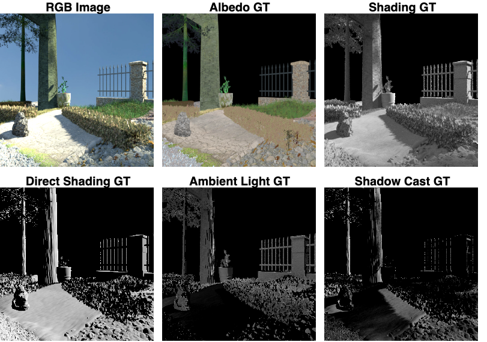

# ShadingNet: Image Intrinsics by Fine-Grained Shading Decomposition

A. S. Baslamisli\*, P. Das\*, H. A. Le, S. Karaoglu, T. Gevers [ShadingNet: Image Intrinsics by Fine-Grained Shading Decomposition](https://arxiv.org/abs/1912.04023). <sub><sup>\* denotes equal contribution.</sup></sub>

We provide the tensorflow implementation of "ShadingNet: Image Intrinsics by Fine-Grained Shading Decomposition", IJCV2021. The provided models were tested with 1.10.1.

The pretrained model can be downloaded from [here](https://uvaauas.figshare.com/ndownloader/files/38127018)

In this paper, we propose to decompose the shading component into direct (illumination) and indirect shading (ambient light and shadows) subcomponents. The aim is to distinguish strong photometric effects from reflectance variations. An end-to-end deep convolutional neural network (ShadingNet) is proposed that operates in a fine-to-coarse manner with a specialized fusion and refinement unit exploiting the fine-grained shading model. It is designed to learn specific reflectance cues separated from specific photometric effects to analyze the disentanglement capability. A large-scale dataset of scene-level synthetic images of outdoor natural environments is provided with fine-grained intrinsic image ground-truths. Large scale experiments show that our approach using fine-grained shading decompositions outperforms state-of-the-art algorithms utilizing unified shading on NED, MPI Sintel, GTA V, IIW, MIT Intrinsic Images, 3DRMS and SRD datasets. 

## Dataset



[DOWNLOAD](Coming soon)

We provide the dataset used to train and test the network. We extend a subset of the (synthetic) Natural Environment Dataset (NED) introduced by Sattler et al. (2017); Baslamisli et al. (2018a) to generate reflectance, direct shading (shading due to surface geometry and illumination conditions), ambient light and shadow cast ground-truth images. The dataset contains garden/park like natural (out-door) scenes including trees, plants, bushes, fences, etc. Furthermore, scenes are rendered with different types of terrains, landscapes, and lighting conditions. Addition-ally, real HDR sky images with a parallel light source are used to provide realistic ambient light. Moreover, light source properties are designed to model daytime lighting conditions to enrich the photometric effects. It includes reflectance (albedo) direct shading (shading due to surface geometry and illumination conditions), ambient light and shadow cast ground-truth images. [The dataset can be downloaded from here.](coming soon!)

### Dataset structure
The dataset stores the images as mat files, with each component (except the normals, light source and photometrics) in the range of [0, 1]. The images are not gamma corrected. The dataset is arranged as follows:

  * composite: This is the final rendered image which is to be decomposed into the intrinsics components. This is used as the input to the network.

  * mask: Masks for the valid pixels.

  * albedo: Contains the albedo ground truths.

  * normals: These are the rendered normals rescaled to the range of [0, 1] for visualization purposes.
  * real_normals: These are the raw values of the rendered normals without any rescaling, hence they are in the range of [-1, 1]. these can be further used for downstream application.

  * light_source: Global light source positions. Contains [x, y, z] position vectors.

  * shading: These are the traditional combined shading ground truths, including the direct shading, the cast shadows and the ambient lights.

  * direct_shading: These direct shading ground-truths due to direct light. computed using the cosine law between the normals and the light source direction and intensity eq.3 of the paper.
  * photometric: This is the combination of shadows and ambient illumination. This is obtained by: Shading - direct_shading. The value range is [-1, 1], where shadow = photometric < 0 & ambient = photometric > 0. Please check section 4.2 in the paper for more details.
  * shadow: These are the shadow cast ground truths. The negative values from the photometric is extracted and inverted. The range is [0, 1].
  * ambient: These are the ambinet light ground truths. The positive values from the photometric is extracted. The range is [0, 1].

  * train_files.txt: List of the training file names used to train the network.
  * test_files.txt: List of the test file names used to evaluate the network performance used in the results of Table 1. These can be used as the benchmark.


## Requirements
Please install the following:
1. Tensorflow 1.10.1
2. skimage
3. opencv3

## Inference
The model expects 8bit RGB images of 256x256 pixels as inputs. In the evaluate.py file change the following:
1. L33: Point to the place where you download the pretrained model.
2. L35: Point to the path of the image to be tested

For ease of testing we already provide a sample image and the corresponding line in the script filled in.

The script can then be run from the command line as follows:
```
python evaluate.py
```

## Citation
Please cite the paper if it is useful in your research:
```
@article{Baslamisli\_Das\_2021,
 author = {A. ~S. Baslamisli* and P. Das* and H. ~A. Le and S. Karaoglu and T. Gevers},
 title = {ShadingNet: Image Intrinsics by Fine-Grained Shading Decomposition},
 journal = {International Journal of Computer Vision},
 volume = {129},
 number = {8},
 pages = {2445-2473},
 doi = {https://doi.org/10.1007/s11263-021-01477-5},
 year = 2021
}
```
